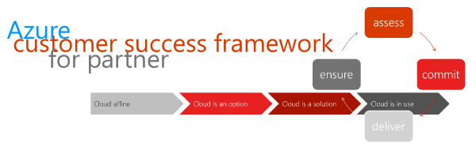
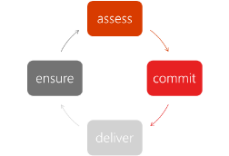

# Azure Customer Success Framework for partner

There are many ways to engage with customers when it comes to Azure cloud usage. We've put this in a structured lightweight framework.
What does the framework include:

- A structured approach
- Complete workshop formats including material and procedure
- Methods and tools from business consulting
- Various templates and templates 
  (currently under construction)
- Notes and experiences

## the iterative approach

In lot of frameworks you see the approach ...

|Phase|Explanation|
|---|---|
|assess|Determine the maturity of the customer|
|commit|Get the commitment on the goals of the engagement|
|deliver|Deliver the workshop or engagement to the customer|
|ensure|Ensure that the goal of the engagement are reached and next steps are defined|

## assess - the maturity model

Overview of the maturity level model:

In the __assess phase__ the maturity of the customer should be determent, to deliver the wright type of engagement to the customer. We defined four maturity levels:

|Level|Explanation|
|---|---|
|__Cloud affine__|The customer has hardly had any contact with Azure so far and wants to get to know the platform and discover potential use cases.|
|__Cloud is an option__|The customer knows Azure, however, wants to get deeper and have first experiences in a topic.|
|__Cloud is a solution__|The customer is aware of his use case in Azure and wants to prove the feasibility of the solution and, if necessary, to support it with a business case.|
|__Cloud is in use__|Customer already operates an Azure environment but sees further potential in his business or wants to improve his operation.|

depending on the level of the customer, there is variety of engagement to choose from in every level.

### cloud affine

- Azure Enablement Workshop
- EBC

### cloud is an option

- Microsoft Cloud Workshops
- Azure Governance Workshop

### cloud is a solution

- Deliver a Architecture Design Session (ADS)
- Start a pilot or PoC

### cloud is in use 

- Microsoft Cloud Workshop
- Azure Optimization Workshop

## commit - 

## deliver - 

## ensure

## Links

- [Success Framework PDF](0_framework/Azure–CustomerSuccessFrameworkforPartner.pdf) 
- [Microsoft Cloud Workshops](http://microsoftcloudworkshop.com/)

